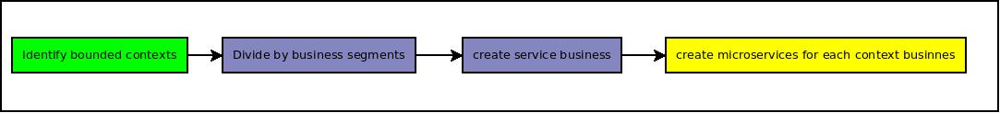

# Ulisses Cavalcante

## Experience Details

### Senior Consultant - Altitude Software
**NOV 2018 - FEB 2020**

#### Document Sincronization (Project Deployed)

In this project they needed a disaster recovery environment, all the configuration files and scripts needed to be syncronized periodically. 

My aproach to solve this demand was to create an agnostic(linux or windows) service in dotnet core to syncronize the files, in this service configuration or through env variables you can add the source and destination folders that can be reached through SMB protocol. I'm using a md5sum to verify if the files have been modifed in the source folders and compare it with the destination to decide if I can copy each file, that application has a dockerfile to be published in azure container instances. 

#### Angular Dashboard with a service consolidation backend (Project Canceled)

In this project they needed a dashboard to show business and telephony statics through a webplataform. 

My aproach to solve this demand was to create a frontend in angular using RxJS to get data from a backend and show dashboards using ChartJS library, in my backend, I built a dotnet core webapi to get the data from another apis and consolidate it from multiple sources(business apis and Telephony aplication api), for both of them I was using applications with dockerfile, in angular I built it to run using Nginx application server, and for dotnet my api was agnostic(Linux and Windows) and stateless received a request from the frontend and it called other apis(business and teleplhony) and made a data consolidation and it returned their data to the frontend, if any api fails the dashbord shows the last data with the message with datetime when this data is collected. 

### Systems Analyst - Lojas Marisa varejista
**APR 2014 - Oct 2018**

#### Migration from monolith to microservices

First things first I did not finish this project integrally they divided this into phases like this roadmap below and I had only worked in the blue phases. 

1. **Identify bounded context** (I did not work here) Our architect identify in monolith application where there are the bounded contexts and layers to divide the application. 
1. **Divide by business segments** (I worked here) I received IVR(Interactive voice response) segment to work and my demand was to create a new library that would deliver any information of balance and credit limit to an external voice service, I started to refactor every method in our application and started using external libraries to get data or business rules and to not processes internal rules anymore. 
1. **Create service Business** (I worked here) Create an independend service that consumes our library and consumes external services throuth RESTfull and not a more direct library, but all services running in the same server.
1. **Create microservices** (changed my job) I know in this phase they will first change their services to other servers and make them scaleable, and then divide their services to small services with single responsable.

This project is a long term project between phase 2 and 3 I spent a few months, in this project I learned a lot of things and started my interest for docker and containers.
